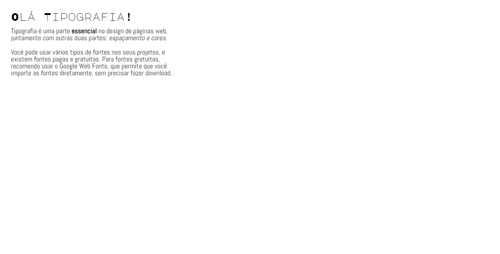

# Basic bio

To track every bit of my development through the codar.me's input course, I plan to submit my my results and resolutions of the proposed challenges. 

This page corresponds to the fourth challenge, styling the topography of the html page with CSS.

[Click here to acess](https://manutourinho.github.io/typography-challenge/)

## ⚙️ Tecnologies

— CSS
— HTML
 
## 💗 Contact

manuelatourinho@outlook.com 
manuelatourinhodeoliveira@gmail.com

